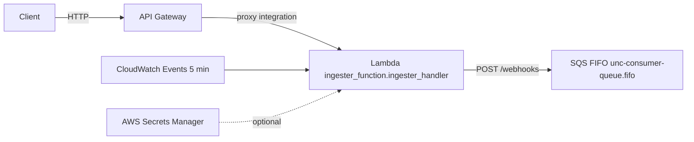

# The Ingestion Service

Minimal AWS Lambda behind API Gateway that enqueues POST /webhooks bodies to an SQS FIFO queue. Structured JSON logging, Secrets Manager, CI/CD via GitHub Actions.


### Architecture



### Endpoint
- POST `/webhooks`: enqueues raw body to SQS FIFO.

### Quick start
```bash
pip install -r requirements.txt
```
```python
from ingester_function import ingester_handler
event = {"httpMethod": "POST", "path": "/webhooks", "body": '{"hello":"world"}'}
print(ingester_handler(event, None))
```

### Deploy
- Push to `main` deploys via GitHub Actions.
- Repo secrets: `AWS_ACCESS_KEY_ID`, `AWS_SECRET_ACCESS_KEY`, `AWS_ACCOUNT_ID`.
- Defaults: region `us-east-1`, function `unc-ingester-lambda`, API `unc-ingester-api`, queue `unc-consumer-queue.fifo`.